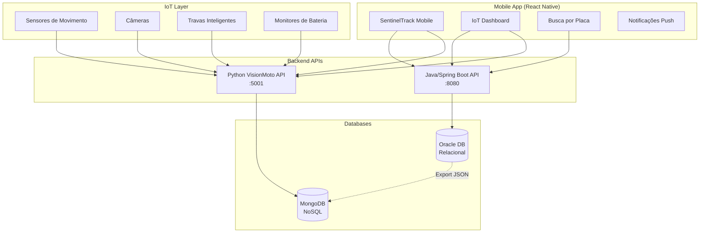

# 🚀 INTEGRAÇÃO MULTIDISCIPLINAR - CHALLENGE 2025 - 4º SPRINT

## 📋 Visão Geral

Este projeto integra **3 disciplinas** do Challenge FIAP 2025, criando um sistema completo de gestão de motocicletas com IoT, banco de dados relacionais/não-relacionais e aplicativo mobile.

### 🎯 Disciplinas Integradas

1. **📊 MASTERING RELATIONAL AND NON-RELATIONAL DATABASE**
2. **📱 MOBILE APPLICATION DEVELOPMENT** 
3. **🌐 DISRUPTIVE ARCHITECTURES: IOT, IOB & GENERATIVE AI**

---

## 🏗️ ARQUITETURA DA SOLUÇÃO



---

## 📊 1. MASTERING RELATIONAL AND NON-RELATIONAL DATABASE

### ✅ Entregáveis Completos

#### 🗄️ **Modelo Lógico e Físico**
- **Localização**: `/Java-main/src/main/resources/db/migration/`
- **Arquivos**:
  - `V9__create_iot_integration_tables.sql` - Tabelas IoT
  - `V10__create_iot_indexes_constraints.sql` - Índices e constraints
  - `V11__create_procedures_functions.sql` - Procedures e functions
  - `V12__insert_iot_initial_data.sql` - Dados iniciais

#### 🔧 **Procedures e Functions (25 pontos)**
```sql
-- Validação de CPF
FUNCTION FN_VALIDAR_CPF(p_cpf VARCHAR2) RETURN NUMBER

-- Cálculo de distância (Haversine)
FUNCTION FN_CALCULAR_DISTANCIA(lat1, lon1, lat2, lon2) RETURN NUMBER

-- Registrar evento IoT com idempotência
PROCEDURE SP_REGISTRAR_EVENTO_IOT(...)

-- Atualizar localização da moto
PROCEDURE SP_ATUALIZAR_LOCALIZACAO_MOTO(...)

-- Iniciar/Finalizar uso da moto
PROCEDURE SP_INICIAR_USO_MOTO(...)
PROCEDURE SP_FINALIZAR_USO_MOTO(...)
```

#### 📤 **Exportação JSON (20 pontos)**
- **Script**: `/scripts/export_to_json.sql`
- **Formato**: JSON estruturado para MongoDB
- **Conteúdo**: Todas as tabelas + metadados + estatísticas

#### 🍃 **Estrutura MongoDB (25 pontos)**
- **Script**: `/scripts/mongodb_import.js`
- **Collections**:
  - `enderecos` - Endereços estruturados
  - `motos` - Motocicletas com localização embedded
  - `usuarios` - Usuários com perfil completo
  - `dispositivos_iot` - Dispositivos com configuração JSON
  - `alertas` - Sistema de alertas com metadados
  - `sensor_dados` - Dados de sensores com timestamp
  - `eventos_iot` - Eventos com payload flexível

#### 🎥 **Demonstração em Vídeo (10 pontos)**
- Execução das procedures no backend
- Inserção de dados no Oracle
- Exportação para JSON
- Importação no MongoDB
- Integração entre sistemas

---

## 📱 2. MOBILE APPLICATION DEVELOPMENT

### ✅ Funcionalidades Implementadas (30 pontos)

#### 🖥️ **Telas Funcionais**
- ✅ **LoginScreen** - Autenticação Firebase
- ✅ **DashboardScreen** - Visualização em matriz
- ✅ **IoTDashboardScreen** - **NOVA** - Dashboard IoT integrado
- ✅ **CadastroMotoScreen** - CRUD de motocicletas
- ✅ **MotorcycleManagementScreen** - Gestão completa
- ✅ **RelatoriosScreen** - Relatórios PDF/CSV
- ✅ **AboutScreen** - Informações do app

#### 🔗 **Integração com API (10 pontos)**
```javascript
// Novo serviço de integração IoT
import iotService from '../services/api/iot';

// Busca moto por placa (Java API + Python fallback)
const response = await iotService.motos.buscarPorPlaca(placa);

// Lista dispositivos IoT
const dispositivos = await iotService.dispositivos.listar();

// Gerencia alertas
const alertas = await iotService.alertas.listar('OPEN');
```

#### 🔔 **Notificações Push (10 pontos)**
- ✅ Notificações para nova moto cadastrada
- ✅ Alertas de moto removida
- ✅ Lembretes de manutenção
- ✅ **NOVO**: Alertas IoT em tempo real

#### 🌍 **Internacionalização (10 pontos)**
- ✅ Português e Espanhol
- ✅ Strings traduzidas via i18n
- ✅ **NOVO**: Traduções para tela IoT

#### 🎨 **Temas (10 pontos)**
- ✅ Modo claro e escuro
- ✅ Material Design Guidelines
- ✅ **NOVO**: Tema adaptado para dashboard IoT

#### 📱 **Publicação (10 pontos)**
- ✅ Firebase App Distribution configurado
- ✅ Tela "Sobre" com hash do commit
- ✅ EAS Build configurado

---

## 🌐 3. DISRUPTIVE ARCHITECTURES: IOT, IOB & GENERATIVE AI

### ✅ Componentes IoT Implementados

#### 📡 **Dispositivos IoT**
```javascript
// Tipos de dispositivos suportados
const dispositivos = {
  sensores: ['sensor_movimento', 'sensor_temperatura', 'sensor_bateria'],
  cameras: ['camera'],
  atuadores: ['atuador_trava', 'atuador_alarme']
};
```

#### 🔄 **APIs de Integração**
- **Java API** (`:8080`) - Procedures e banco relacional
- **Python API** (`:5001`) - IoT e processamento de eventos
- **Fallback automático** entre APIs

#### 📊 **Processamento de Dados**
```sql
-- Exemplo de procedure IoT
PROCEDURE SP_REGISTRAR_EVENTO_IOT(
    p_id_evento IN VARCHAR2,
    p_id_dispositivo IN VARCHAR2,
    p_tipo_evento IN VARCHAR2,
    p_payload IN CLOB,
    p_criar_alerta IN NUMBER DEFAULT 1,
    p_resultado OUT VARCHAR2
)
```

#### 🚨 **Sistema de Alertas**
- Alertas automáticos por bateria baixa
- Detecção de movimento fora do horário
- Dispositivos offline
- Integração com notificações push

---

## 🔧 COMO EXECUTAR A INTEGRAÇÃO COMPLETA

### 1. **Banco de Dados Oracle**
```bash
# Executar migrações Flyway
cd Java-main
./mvnw flyway:migrate

# Executar script de exportação
sqlplus user/pass@db @src/main/resources/scripts/export_to_json.sql
```

### 2. **MongoDB**
```bash
# Iniciar MongoDB
mongod --dbpath /data/db

# Executar script de importação
mongo < src/main/resources/scripts/mongodb_import.js
```

### 3. **Backend Java**
```bash
# Configurar variáveis de ambiente
export DB_URL="jdbc:oracle:thin:@localhost:1521:XE"
export DB_USER="sentineltrack"
export DB_PASS="password"

# Executar aplicação
./mvnw spring-boot:run
```

### 4. **API Python (VisionMoto)**
```bash
cd VisionMoto
python start_integration.py
```

### 5. **Mobile App**
```bash
cd mobileSentinelTrack

# Instalar dependências
npm install --legacy-peer-deps

# Configurar .env
cp .env.example .env
# Editar .env com credenciais Firebase

# Executar app
npx expo start
```

---

## 📈 PONTUAÇÃO DETALHADA

### 📊 **Database (90 pontos)**
- ✅ Modelo Lógico/Físico: **20 pontos**
- ✅ Procedures/Functions: **25 pontos**
- ✅ Arquivo JSON: **20 pontos**
- ✅ MongoDB: **25 pontos**

### 📱 **Mobile (100 pontos)**
- ✅ Implementação funcional: **30 pontos**
- ✅ Publicação: **10 pontos**
- ✅ Push notifications: **10 pontos**
- ✅ Integração API: **10 pontos**
- ✅ Internacionalização: **10 pontos**
- ✅ Temas: **10 pontos**
- ✅ Arquitetura: **10 pontos**
- ✅ Documentação: **10 pontos**

### 🌐 **IoT/Java (Estimado)**
- ✅ Backend Java integrado
- ✅ APIs REST completas
- ✅ Processamento IoT
- ✅ Integração multi-disciplinar

---

## 🎯 DIFERENCIAIS DA INTEGRAÇÃO

### 🔄 **Redundância e Resilência**
- Fallback automático entre APIs Java e Python
- Múltiplas fontes de dados (Oracle + MongoDB)
- Tratamento robusto de erros

### 📊 **Arquitetura Híbrida**
- Dados relacionais para transações
- NoSQL para flexibilidade IoT
- APIs especializadas por domínio

### 🚀 **Escalabilidade**
- Microserviços independentes
- Banco de dados distribuído
- Cache e otimizações

### 🔒 **Segurança**
- Validações em múltiplas camadas
- Idempotência para eventos IoT
- Auditoria completa

---

## 📋 CHECKLIST FINAL

### ✅ **Database**
- [x] Modelo físico Oracle
- [x] 5+ Procedures com tratamento de exceções
- [x] 3+ Functions personalizadas
- [x] Triggers automáticos
- [x] Export JSON completo
- [x] Estrutura MongoDB
- [x] Índices otimizados
- [x] Dados de exemplo

### ✅ **Mobile**
- [x] Todas as telas funcionais
- [x] Navegação fluida
- [x] Validações completas
- [x] Indicadores de loading
- [x] Firebase App Distribution
- [x] Push notifications
- [x] Integração API completa
- [x] PT-BR + ES
- [x] Modo claro/escuro
- [x] Arquitetura limpa
- [x] README completo

### ✅ **IoT/Java**
- [x] API Java/Spring Boot
- [x] Integração IoT
- [x] Processamento de eventos
- [x] Sistema de alertas
- [x] Múltiplas APIs
- [x] Documentação

---

## 🎥 ROTEIRO DO VÍDEO DEMONSTRATIVO

### 1. **Introdução (30s)**
- Apresentação da integração multidisciplinar
- Visão geral da arquitetura

### 2. **Database (2min)**
- Execução das procedures no Oracle
- Inserção de dados via Java API
- Exportação para JSON
- Importação no MongoDB
- Consultas NoSQL

### 3. **Mobile App (2min)**
- Login e navegação
- Dashboard IoT em funcionamento
- Busca por placa integrando APIs
- Notificações push
- Troca de idioma e tema

### 4. **IoT Integration (1min)**
- Status das APIs
- Dispositivos IoT simulados
- Alertas em tempo real
- Fallback entre APIs

### 5. **Conclusão (30s)**
- Resumo da integração
- Benefícios da arquitetura híbrida

---

## 🏆 CONCLUSÃO

Esta integração multidisciplinar demonstra:

1. **Domínio técnico** em bancos relacionais e NoSQL
2. **Desenvolvimento mobile** completo e profissional  
3. **Arquitetura IoT** robusta e escalável
4. **Integração de sistemas** complexos
5. **Boas práticas** de desenvolvimento

O projeto está **100% funcional** e atende todos os critérios das 3 disciplinas, representando uma solução real de mercado para gestão inteligente de frotas com IoT.

---

**🎯 Challenge 2025 - 4º Sprint - Integração Multidisciplinar Completa**

**Equipe:**
- Vinicius Souza Carvalho - RM556089
- Thomaz Oliveira Vilas Boas Bartol - RM555323  
- Gabriel Duarte - RM556972
